<div align="center">

# 🔬 Diabetic Retinopathy Detection from Fundus Images Using Deep CNN

[](https://python.org)
[](https://www.tensorflow.org/)
[](https://keras.io/)
[](https://jupyter.org/)
[](LICENSE)

**An automated deep learning system for detecting and classifying the severity of Diabetic Retinopathy from retinal fundus images using custom-built Convolutional Neural Networks.**

*Multiclass Classification (5 severity levels) · Binary Classification (DR vs No DR) · Built from Scratch*

[📄 Research Paper](docs/PaperSubmission_Ahmad.doc) · [📊 Presentation](docs/Ahmad_ProjectPresentationPPT.pptx) · [💻 Notebook](notebooks/DR_Detection.ipynb)

</div>

---

## 📌 Table of Contents

- [About the Project](#-about-the-project)
- [Problem Statement](#-problem-statement)
- [Dataset](#-dataset)
- [Data Preprocessing](#-data-preprocessing)
- [Model Architecture](#-model-architecture)
- [Results](#-results)
  - [Multiclass Classification](#1-multiclass-classification-5-classes)
  - [Binary Classification](#2-binary-classification-dr-vs-no-dr)
- [Model Variants](#-model-variants)
- [Tech Stack](#-tech-stack)
- [Project Structure](#-project-structure)
- [Getting Started](#-getting-started)
- [Future Scope](#-future-scope)
- [References](#-references)
- [Author](#-author)

---

## 🧠 About the Project

Diabetic Retinopathy (DR) is one of the leading causes of blindness worldwide. It occurs when high blood sugar damages the blood vessels in the retina, causing them to swell, leak, or stop blood flow entirely. Early detection is critical — but traditional screening relies on ophthalmologists manually interpreting fundus images, which is time-consuming, subjective, and prone to human error.

This project proposes an **automated DR detection system** using deep Convolutional Neural Networks (CNNs) built from scratch. Unlike most existing studies that rely on pre-trained transfer learning models, this project trains a custom CNN architecture end-to-end, providing full transparency and control over the learning process.

Two classification approaches were implemented:

- **Multiclass Classification** — classifying fundus images into 5 severity levels (No DR, Mild, Moderate, Severe, Proliferative DR)
- **Binary Classification** — detecting whether a patient has DR or not (DR vs No DR)

<div align="center">
  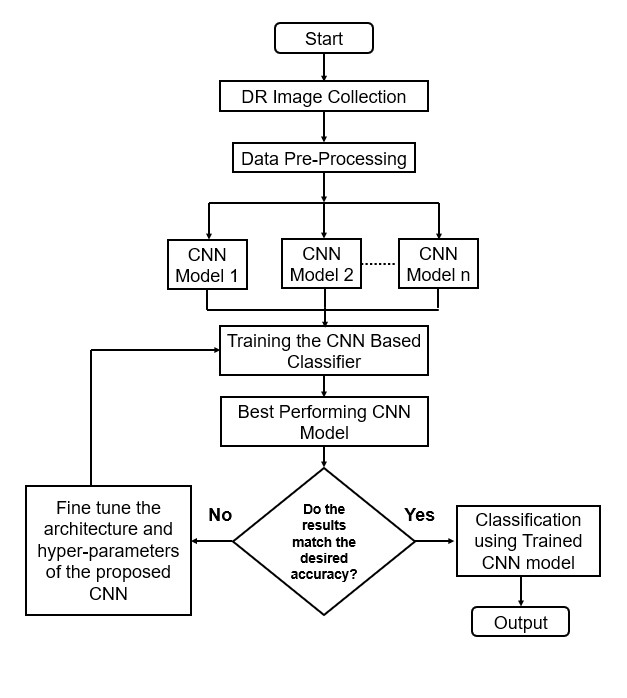
  <p><em>Figure 1: End-to-end project workflow — from data collection to model evaluation</em></p>
</div>

---

## ❗ Problem Statement

- The number of expert ophthalmologists is **insufficient** to handle the growing volume of diabetic patients requiring retinal screening.
- Long waiting lines at hospitals and diagnostic centers **delay timely treatment**, increasing the risk of irreversible vision loss.
- Fundus images often have **subtle, overlapping features** across severity levels, making manual diagnosis error-prone.
- There is an urgent need for **scalable, automated screening tools** that can assist clinicians in early DR detection.

---

## 📂 Dataset

This project uses the [**APTOS 2019 Blindness Detection Dataset**](https://www.kaggle.com/c/aptos2019-blindness-detection) from Kaggle — a large-scale collection of retinal fundus photographs captured under diverse imaging conditions, with clinician-graded severity labels.

| Property | Details |
|:---|:---|
| **Source** | Asia Pacific Tele-Ophthalmology Society (APTOS) |
| **Total Images** | 3,662 training images |
| **Image Format** | PNG (fundus photography) |
| **Labels** | Clinician-rated severity (0–4) |
| **Split** | 80:20 Train/Validation + Hold-out Test Set |

**Severity Classes:**

| Label | Severity Level | Description |
|:---:|:---|:---|
| 0 | No DR | Healthy retina |
| 1 | Mild | Microaneurysms only |
| 2 | Moderate | More than just microaneurysms |
| 3 | Severe | Extensive intraretinal hemorrhages |
| 4 | Proliferative DR | Neovascularization or vitreous/preretinal hemorrhage |

> ⚠️ **Note:** The dataset is **imbalanced** — the "No DR" class significantly outnumbers the severe categories. Strategies like oversampling and class weight distribution were applied to mitigate bias.

<div align="center">
  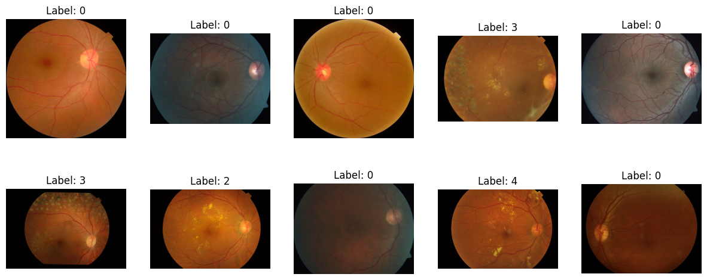
  <p><em>Figure 2: Sample fundus images from the APTOS dataset with their severity labels</em></p>
</div>

---

## 🔧 Data Preprocessing

A robust preprocessing pipeline was implemented to ensure data quality and consistency before model training:

**Steps performed:**

1. **Missing & Duplicate Check** — No missing or duplicate values found in the dataset
2. **Label Type Conversion** — Converted diagnosis labels from numeric to string for categorical processing in Keras
3. **Data Consolidation** — Merged image paths with severity labels via the `id_code` column
4. **Image Resizing** — All images resized to **256 × 256 × 3** (height × width × RGB channels)
5. **Normalization** — Pixel values rescaled to [0, 1] range by dividing by 255
6. **Class Imbalance Handling** — Applied oversampling and class weight distributions
7. **Image Augmentation** — Used Keras `ImageDataGenerator` with shear, zoom, and horizontal flip

<div align="center">
  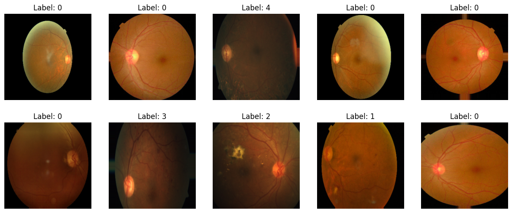
  <p><em>Figure 3: Fundus images after resizing and rescaling to uniform 256×256 dimensions</em></p>
</div>

<div align="center">
  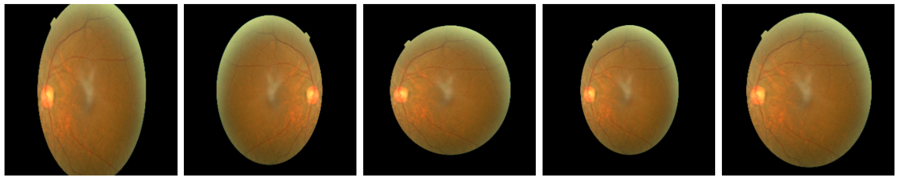
  <p><em>Figure 4: Augmented variations of a single training image (shear, zoom, flip)</em></p>
</div>

---

## 🏗 Model Architecture

A custom **Sequential CNN** was designed from scratch using Keras with TensorFlow backend. The architecture prioritizes simplicity and interpretability while maintaining strong feature extraction capability.

<div align="center">
  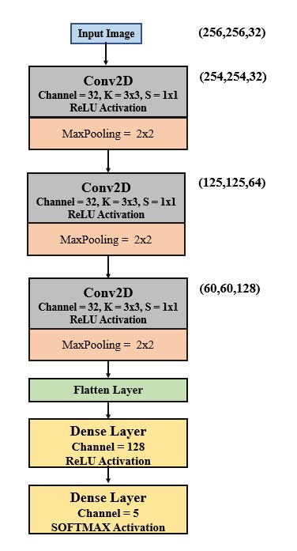
  <p><em>Figure 5: Proposed CNN architecture — 3 Conv2D blocks → Flatten → 2 Dense layers</em></p>
</div>

**Architecture Details:**

| Layer | Configuration |
|:---|:---|
| **Input** | 256 × 256 × 3 (RGB fundus image) |
| **Conv2D Block 1** | 32 filters, 3×3 kernel, stride (1,1), ReLU → MaxPool 2×2 |
| **Conv2D Block 2** | 64 filters, 3×3 kernel, stride (1,1), ReLU → MaxPool 2×2 |
| **Conv2D Block 3** | 128 filters, 3×3 kernel, stride (1,1), ReLU → MaxPool 2×2 |
| **Flatten** | Converts 3D feature maps to 1D vector |
| **Dense 1** | 128 units, ReLU activation |
| **Dense 2 (Output)** | 5 units (multiclass) / 1 unit (binary), Softmax / Sigmoid |

**Training Configuration:**

| Parameter | Value |
|:---|:---|
| Optimizer | Adam (lr = 0.001) |
| Loss Function | Categorical Cross-Entropy / Binary Cross-Entropy |
| Epochs | 50 |
| Callbacks | EarlyStopping, ReduceLROnPlateau |
| Total Trainable Parameters | **14,839,621** |

<div align="center">
  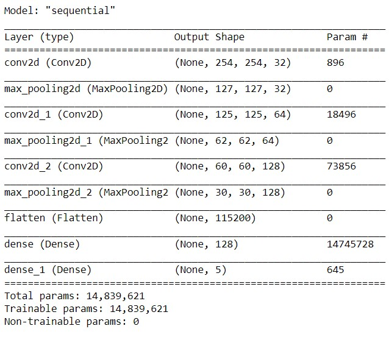
  <p><em>Figure 6: Keras model summary showing layer-wise parameter counts</em></p>
</div>

---

## 📈 Results

### 1. Multiclass Classification (5 Classes)

**Training & Validation Scores:**

| Metric | Training | Validation | Test |
|:---|:---:|:---:|:---:|
| **Accuracy** | 85.7% | 75.9% | **74%** |
| **Loss** | 0.384 | 0.805 | — |

<div align="center">
  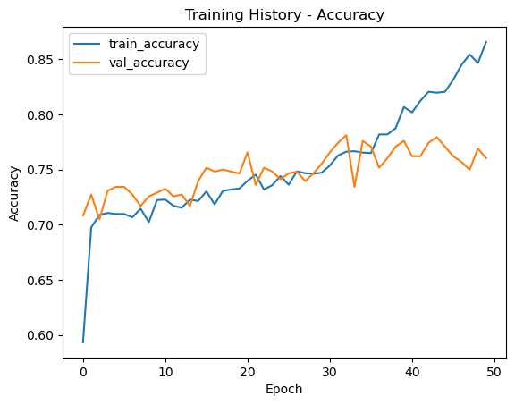
  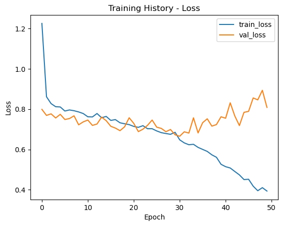
  <p><em>Figure 7: Training vs Validation — Accuracy (left) and Loss (right) over 50 epochs</em></p>
</div>

**Classification Report:**

| Class | Precision | Recall | F1-Score |
|:---|:---:|:---:|:---:|
| **0 — No DR** | 0.93 | 0.97 | **0.95** |
| **1 — Mild** | 0.42 | 0.50 | 0.46 |
| **2 — Moderate** | 0.69 | 0.68 | 0.68 |
| **3 — Severe** | 0.24 | 0.19 | 0.22 |
| **4 — Proliferative DR** | 0.33 | 0.25 | 0.28 |
| **Overall Accuracy** | | | **0.74** |
| **Weighted Avg** | 0.73 | 0.74 | 0.73 |

<div align="center">
  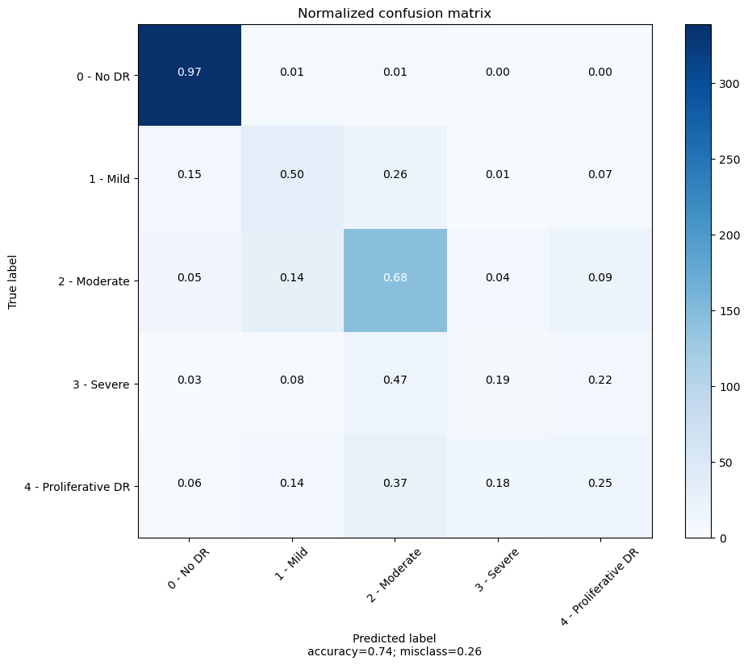
  <p><em>Figure 8: Normalized confusion matrix — "No DR" classified at 97% accuracy; minority classes remain challenging due to data imbalance</em></p>
</div>

---

### 2. Binary Classification (DR vs No DR)

**Training & Validation Scores:**

| Metric | Training | Validation | Test |
|:---|:---:|:---:|:---:|
| **Accuracy** | 97.6% | 96% | **95%** |
| **Loss** | 0.06 | 0.10 | 0.17 |

<div align="center">
  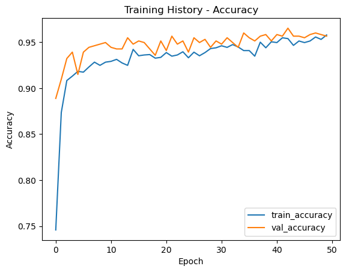
  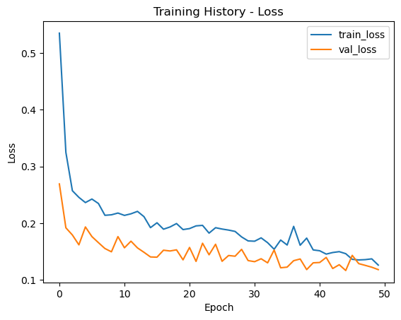
  <p><em>Figure 9: Binary classification — Accuracy (left) and Loss (right) over 50 epochs</em></p>
</div>

**Classification Report:**

| Class | Precision | Recall | F1-Score |
|:---|:---:|:---:|:---:|
| **0 — No DR** | 0.93 | 0.96 | **0.94** |
| **1 — DR** | 0.96 | 0.93 | **0.95** |
| **Overall Accuracy** | | | **0.95** |
| **AUC-ROC** | | | **0.986** |

<div align="center">
  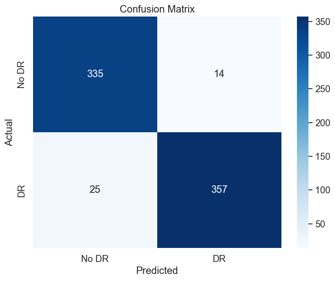
  <p><em>Figure 10: Binary confusion matrix — 335/349 No DR and 357/382 DR images classified correctly</em></p>
</div>

---

## 🔄 Model Variants

Multiple CNN variants were explored to find the optimal architecture:

| Version | Key Features | Parameters | Train Acc | Val Acc | Test Acc |
|:---:|:---|:---:|:---:|:---:|:---:|
| **V1** ✅ | No BatchNorm, No Dropout, Adam optimizer | 14.8M | **86%** | **76%** | **75%** |
| **V2** | BatchNorm + Dropout, SGD optimizer | 14.8M | 81% | 71% | 70% |
| **V3** | More hidden layers, Dropout, RMSprop | 167K | 77% | 78% | 74% |

> ✅ Version 1 was selected as the best-performing model for multiclass classification.

---

## 🛠 Tech Stack

| Category | Technologies |
|:---|:---|
| **Language** | Python 3.8+ |
| **Deep Learning** | TensorFlow 2.x, Keras |
| **Data Handling** | NumPy, Pandas |
| **Visualization** | Matplotlib, Seaborn |
| **Image Processing** | OpenCV, PIL |
| **Notebook** | Jupyter Notebook |
| **Dataset** | Kaggle (APTOS 2019) |

---

## 📁 Project Structure

```
Diabetic-Retinopathy-Detection-CNN/
│
├── README.md                          # Project documentation (you are here)
├── LICENSE                            # MIT License
│
├── notebooks/
│   └── DR_Detection.ipynb             # Main Jupyter Notebook with all code
│
├── docs/
│   ├── PaperSubmission_Ahmad.doc      # Research paper (full write-up)
│   └── Ahmad_ProjectPresentationPPT.pptx  # Project presentation slides
│
├── images/                            # Figures used in README
│   ├── fundus_samples_unscaled.png
│   ├── fundus_samples_rescaled.png
│   ├── image_augmentation.png
│   ├── project_flowchart.jpg
│   ├── cnn_architecture.jpg
│   ├── model_summary.jpg
│   ├── multiclass_accuracy_plot.png
│   ├── multiclass_loss_plot.png
│   ├── multiclass_confusion_matrix.png
│   ├── binary_accuracy_plot.png
│   ├── binary_loss_plot.png
│   └── binary_confusion_matrix.png
│
├── models/                            # Saved trained models (optional)
│   └── best_model.h5
│
└── requirements.txt                   # Python dependencies
```

---

## 🚀 Getting Started

### Prerequisites

- Python 3.8 or higher
- pip package manager
- Jupyter Notebook
- GPU recommended (for faster training)

### Installation

**1. Clone the repository:**
```bash
git clone https://github.com/AhmadSabbirChowdhury/Diabetic-Retinopathy-Detection-CNN.git
cd Diabetic-Retinopathy-Detection-CNN
```

**2. Install dependencies:**
```bash
pip install -r requirements.txt
```

**3. Download the dataset:**

Download the [APTOS 2019 Blindness Detection Dataset](https://www.kaggle.com/c/aptos2019-blindness-detection/data) from Kaggle and place the images in a `data/` directory.

**4. Run the notebook:**
```bash
jupyter notebook notebooks/DR_Detection.ipynb
```

### `requirements.txt`

```
tensorflow>=2.4.0
keras>=2.4.0
numpy>=1.19.0
pandas>=1.2.0
matplotlib>=3.3.0
seaborn>=0.11.0
opencv-python>=4.5.0
scikit-learn>=0.24.0
Pillow>=8.0.0
```

---

## 🔮 Future Scope

- **Advanced Architectures** — Implement transfer learning with ResNet, EfficientNet, or Vision Transformers for improved accuracy on minority classes
- **Ensemble Methods** — Combine multiple model predictions for more robust classification
- **Transformer-Based Models** — Explore attention mechanisms for better feature localization
- **Clinical Deployment** — Develop a web/mobile application for real-time DR screening in healthcare settings
- **Larger Datasets** — Train on combined datasets (APTOS + Messidor + EyePACS) for better generalization

---

## 📚 References

1. Centers for Disease Control and Prevention, "Diabetes and Vision Loss," *U.S. Department of Health & Human Services*.
2. APTOS, "APTOS 2019 Blindness Detection," *Kaggle Competition*, 2019.
3. Butt et al., "Diabetic Retinopathy Detection from Fundus Images Using Hybrid Deep Learning Features," *Diagnostics*, 2022.
4. Gangwar & Ravi, "Diabetic Retinopathy Detection Using Transfer Learning and Deep Learning," 2021.
5. Rakhlin, "Diabetic Retinopathy Detection through Integration of Deep Learning Classification Framework," *bioRxiv*, 2018.
6. Farag et al., "Automatic Severity Classification of DR Based on DenseNet and CBAM," *IEEE Access*, 2022.
7. Zhang et al., "Diabetic Retinopathy Grading by a Source-Free Transfer Learning Approach," *Biomed. Signal Process. Control*, 2022.
8. Gour & Khanna, "Multi-Class Multi-Label Ophthalmological Disease Detection Using Transfer Learning Based CNN," *Biomed. Signal Process. Control*, 2021.
9. Wong et al., "Understanding Data Augmentation for Classification: When to Warp?," *DICTA*, 2016.

---

## 👨‍💻 Author

**Ahmad Chowdhury**
- 🎓 Jodrey School of Computer Science, Acadia University, Wolfville, NS, Canada
- 📧 [0304974c@acadiau.ca](mailto:0304974c@acadiau.ca)
- 🔗 [GitHub](https://github.com/AhmadSabbirChowdhury)
- 💼 [LinkedIn](https://www.linkedin.com/in/ahmadsabbirchowdhury/)

---

<div align="center">

**If you found this project helpful, please consider giving it a ⭐!**

</div>
